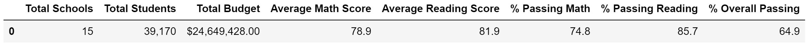
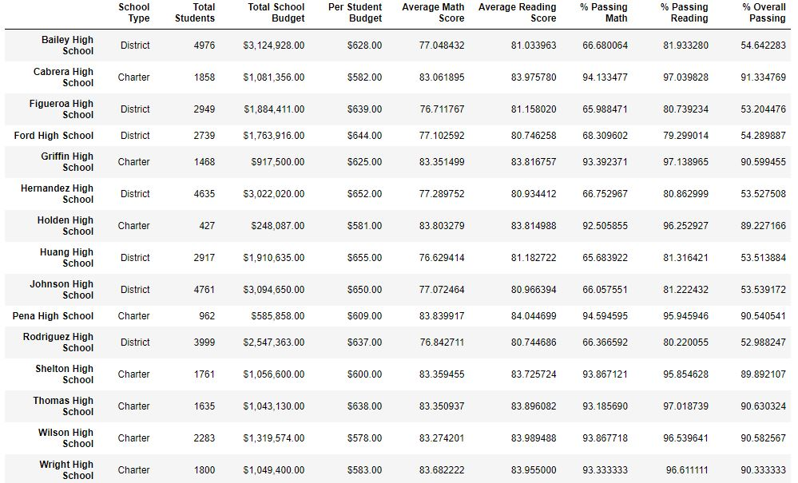
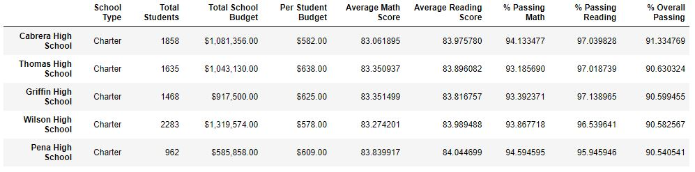
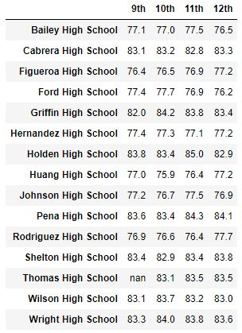
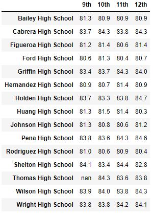
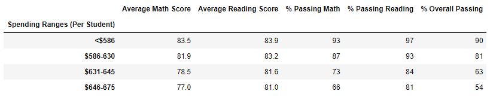
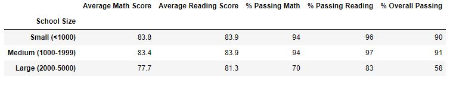
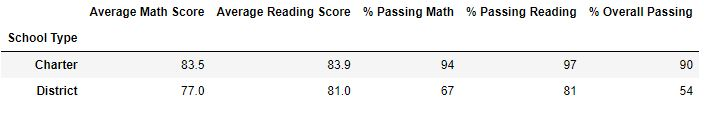

# School District Analysis

## Overview

### Background
I had previously performed an analysis on state testing data for a school district. After completing the analysis, it was discovered that the reading and math grades for Thomas High School ninth-graders had been altered. To up-hold state testing standards, this had to be addressed.
### Purpose
To address the altered grades, the purpose of this analysis was to replace all math and reading scores from Thomas High School ninth graders with NaNs. I was then asked to re-analyze the data with the changed grades, and check for differences between the corrected and uncorrected analysis. 

## Results
- The District Summary is not affected after rounding values.
  
Corrected

Not Corrected

- In the per-school summary, the % Passing Math, % Passing Reading, and % Overall Passing, were slightly higher before correction for Thomas High School. The other schools were unaffected by the correction.

Corrected

Not Corrected

- Before and after the correction, Thomas High School is still ranked second compared to the other schools.

Corrected

Not Corrected

- For math and reading scores by grade, the uncorrected analysis shows grades for the Thomas High School ninth graders, and the corrected analysis shows "nan" for the Thomas High School ninth graders.

Corrected Math

Not Corrected Math

Corrected Reading

Not Corrected Reading

- The correction had no effect on the scores by school spending.

Corrected 

Not Corrected 

- The correction had no effect on the scores by school size.

Corrected 

Not Corrected 

- The correction had no effect on the scores by school type.
  
Corrected 

Not Corrected 

## Summary

After replacing the reading and math scores for the ninth grade at Thomas High School, the biggest change is simply that when comparing scores between schools by grade level, the 9th grade scores from Thomas High School are missing. This maintains the integrity of the data. Additionally, the % Passing Math at Thomas High school is lower after the grade replacements. The % Percent Passing Reading, as well as the % Overall Passing is also lower after the grade replacement. Redoing the analysis with the replaced grades was important to producing correct insights, and upholding state testing standards.
